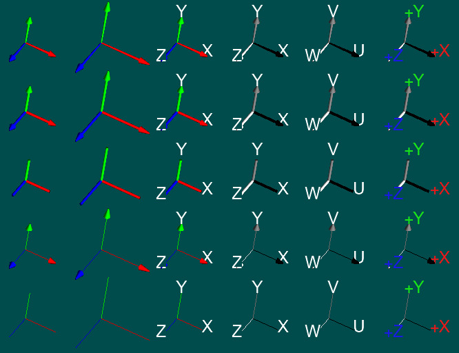

# PrettyXYZ

    "You never get a second chance to make a first impression"
                                                 Andrew Grant

Today, there are thousands of opensource-commercial libraries. They all require a a simple coordinate axes to make user understand where he/she is. While creating a coordinate axes may be trivial, it is also possible that it may require a lot of time. Just for an example, you might not need to render any text in a CAD visualizer. Yet would not that be cool to have it in your coordinate axes?

For a developer, a simple three lines are more than great. But fancy users like *PrettyXYZ*. 



## Getting Started

PrettyXYZ is a header only library. Include it directly and use it.

```
#include "PrettyXYZ.hpp"
```

- To create axis text `#define PRETTY_TEXT_RENDER` before include.
- If you do not use `glew` but your build system takes care of OpenGL calls, to undefine glew use `PRETTY_NO_GLEW` before include. 


```
/*
 * @param _camera     : 16 float camera(view) matrix. Expected to be columnwise as following:  
 *                
 *                      [0,0][1,0][2,0][3,0]
 *                      [0,1][1,1][2,1][3,1]
 *                      [0,2][1,2][2,2][3,2]
 *                      [0,3][1,3][2,3][3,3] <- Translation vector.
 *
 * @param position    : Position of the origin of the axis on screen space. The third parameter
 *                      shall be 0.
 * @param arrow_size  : The size of the arrow. Default 50. 
 * @param render_style: The style of the axis: See STYLE Enums. Default LINE
 * @param render_text : Bool to render text or not. Default False 
 * @param color_axis_x: Color of the x axis. Default red. 
 * @param color_axis_y: Color of the y axis. Default green. 
 * @param color_axis_z: Color of the z axis. Default blue.
 * @param axis_x      : Text written for axis X. Default "X"
 * @param axis_y      : Text written for axis Y. Default "Y"
 * @param axis_z      : Text written for axis Z. Default "Z"
 * @param color_text_x: Color of the text of x axis. Default red. 
 * @param color_text_y: Color of the text of y axis. Default green. 
 * @param color_text_z: Color of the text of z axis. Default blue. 
 */
void prettyCoordinateAxes(const float *_camera,    
                          Vector3 position,        
                          float arrow_size, 
                          STYLE render_style, 
                          bool render_text,
                          Vector3 color_axis_x, 
                          Vector3 color_axis_y,
                          Vector3 color_axis_z, 
                          const char *axis_x,
                          const char *axis_y, 
                          const char *axis_z,
                          Vector3 color_text_x, 
                          Vector3 color_text_y,
                          Vector3 color_text_z);
```

### Prerequisites

No prerequisites unless you want to render text other than modern OpenGL. 

For rendering text `freetype` is necessary. Currently there is no inbuilt Text atlas. "arial.tff" is hard-coded, and shall be a fonts folder. (Feel free to get in touch for suggestions.) 


## License

This project is licensed under the MIT License - see the [LICENSE.md](LICENSE.md) file for details

